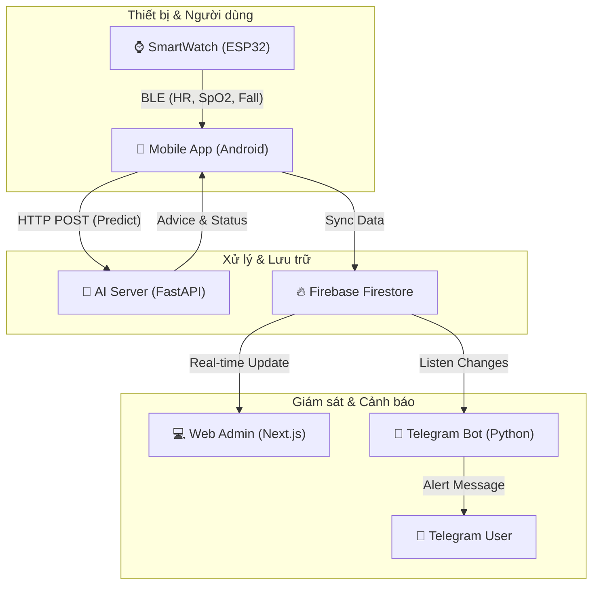

# 🏥 Hệ thống Giám sát Sức khỏe IoT & AI (v4)

Chào mừng đội ngũ phát triển! Đây là kho lưu trữ trung tâm cho toàn bộ hệ thống (Web Admin, AI Server, Telegram Bot).

## 🏗️ Kiến trúc Hệ thống



---

## 📂 Cấu trúc Thư mục
- `/src`: Web Admin Dashboard (Next.js + Tailwind).
- `/ai-server`: Server AI phân tích (FastAPI + Scikit-learn).
- `/bot`: Telegram Bot lắng nghe cảnh báo thời gian thực.

## ⚙️ Hướng dẫn Chạy (Quick Start)

### 1. AI Server
```bash
cd ai-server
# Cài đặt thư viện: pandas, joblib, fastapi, uvicorn, scikit-learn
python -m uvicorn main:app --host 0.0.0.0 --port 8999
```

### 2. Telegram Bot
```bash
cd bot
# Yêu cầu file serviceAccountKey.json từ Firebase
python firebase_listener.py
```

### 3. Web Admin
```bash
npm install
npm run dev
# Truy cập: localhost:3000
```

## 🚩 Lưu ý quan trọng cho Team
1.  **Mô hình v4**: Đang sử dụng 8 features, nếu thay đổi Feature Engineering trong `main.py` hãy báo lại cho team AI.
2.  **Cổng mạng**: App di động hiện mặc định gọi vào cổng `8999`. Đừng thay đổi cổng nếu không cập nhật code App.
3.  **Hàng rào an toàn (Safeguard)**: AI có bộ lọc đè kết quả nếu chỉ số quá đẹp (HR 60-95, SpO2 > 96%) để tránh báo động giả, NHƯNG sẽ luôn ưu tiên cảnh báo TÉ NGÃ.

---
*Chúc team phát triển dự án thành công!* 🚀🏥
